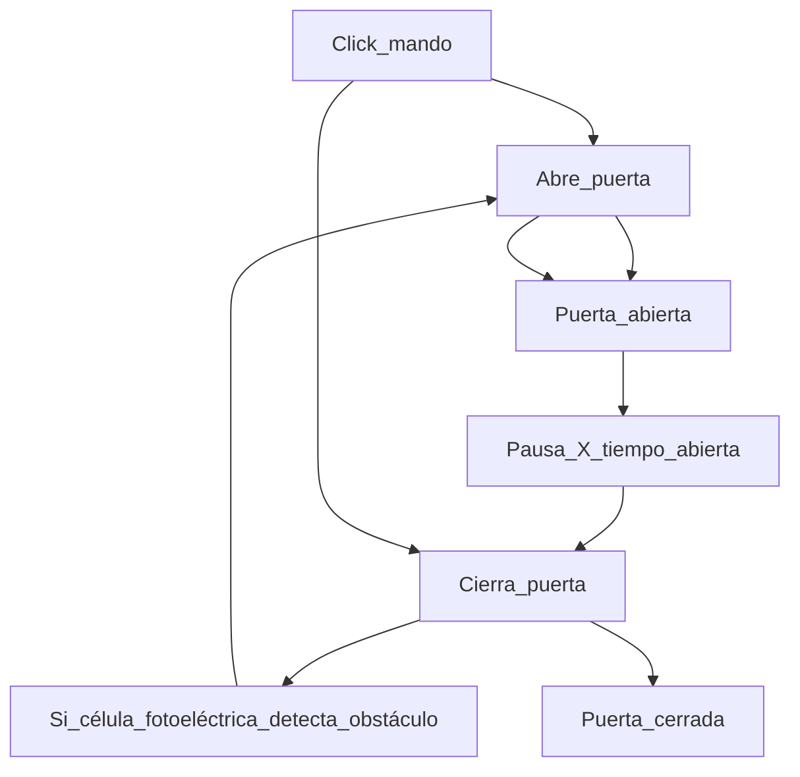

   # Automatic sliding door for garage
   # Control de puerta corredera de garage
   - La apertura se realiza con mando RF es una placa aparte y utilizo la salida de contacto seco del relé.
   - El cierre se realiza automaticamente según el tiempo indicado por defecto 15 segundos.
   - Por seguridad tiene una célula fotoeléctrica que se activa en caso de interponerse en la barrera y evitar atrapamiento.
   - Dispone de un rele seco manejado por el controlador Zigbee, entonces la apertura del garage a través del tablero del vehículo con android auto y home assistant.
   - Se puede obviar el montaje de pantalla, no es necesario para el funcionamiento.
   - Puede elegir entre dos tipos de pantalla, la SSD1306 de 4 pines (https://s.click.aliexpress.com/e/_oB2gdBL) y la sh1106 de 7 pines (https://s.click.aliexpress.com/e/_oofWsrf)
   - La placa optoacoplada de tres reles que he utilizado es esta https://s.click.aliexpress.com/e/_oFawcp3
   - La fuente de alimentación 220v AC a 5v DC es esta https://s.click.aliexpress.com/e/_oFyz5GN
   - He utilizado un conector de 3 pines y el resto son de 2 pines, los conectores son estos https://s.click.aliexpress.com/e/_oph4j1X
   - ¿porqué he utilizado un arduino nano en vez de una placa con wifi? Porque al lugar de la puerta no me llega el wifi pero si me llega la red Zigbee, lo tengo integrado con homeassistant con esa red.
   - Es facil y está comentado el código para poder cambiarlo por otra placa de desarrollo, bien una esp8266 o esp32.
   - Modo persona se ha implementado de la siguiente forma:
     - Click al mando y la puerta comienza a abrir.
     - Cuando alcanza la apertura que usted requiera, vuelva a realizar click y la puerta hará stop.
     - Cuando transcurra el tiempo establecido de pausa, automáticamente se cerrará, también puede cerrarla sin demorar haciendo click en el mando.

Aquí un simple control de flujo:

     
## Imagen genérica del panel de control.

## Imagen detallada del panel de control.

## Imagen de la pantalla de android auto con un botón para abrir la puerta de garaje, integrado con Homeassistant.

Tareas por desarrollar:
- [x] Incluir barrera de infrarojos para prevenir accidentes.
- [x] Incluir destellos led para avisar a los viandantes u otros vehículos de salidas de vehículos.
- [x] Integrable con dos tipos de pantalla OLED, la SSD1306 de 4 pines y la sh1106 de 7 pines.
- [x] Incluir entrada para que la puerta abra parcialmente para acceso de personas.
- [ ] Se aceptan mejoras de código o por implementar.

     > [!WARNING]
     > UTILICE EL CÓDIGO Y SUS RECURSOS CON SUMO CIUDADO, EXISTE RIESGO DE ELECTROCUCIÓN O DESCARGAS ELECTRICAS EN LA MANIPULACIÓN DE COMPONENTES ELÉCTRICOS, EXISTEN RIESGOS DE ATRAPAMIENTO O ESTRANGULAMIENTO EN EL ACCIONAMIENTO DEL MOTOR. TODO LO QUE USTED REALICE SERÁ BAJO SU PROPIA RESPONSABILIDAD, INCLUIDO EL MANEJO DE ESTE CÓDIGO FUENTE.
